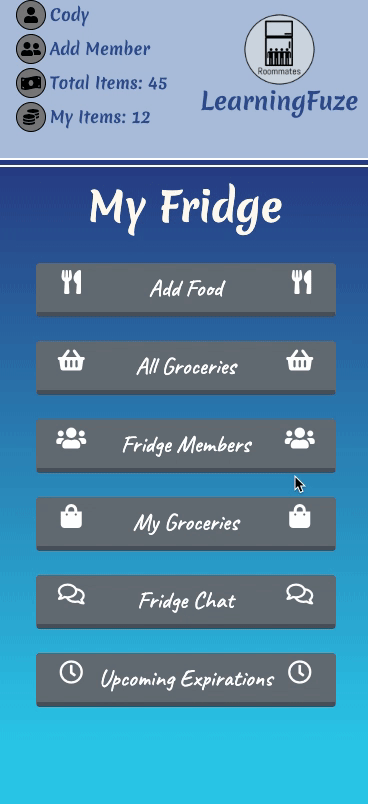

# Roommates
A full-stack web application that helps users organize the items in their shared fridge.

# Technologies Used
<ul>
  <li>React.js</li>
  <li>HTML5</li>
  <li>CSS3</li>
  <li>Bootstrap 4</li>
  <li>Express</li>
  <li>Node.js</li>
  <li>Webpack</li>
  <li>PostgreSQL</li>
</ul>

# Live Demo
Try the application at <a href="https://roommates.danny-dae-kim.com/">https://roommates.danny-dae-kim.com/</a>

# Features
<ul>
  <li>User can create a fridge</li>
  <li>User can join a fridge</li>
  <li>User can create new member</li>
  <li>User can select existing member</li>
  <li>User can add food to fridge</li>
  <li>User can view all groceries in fridge</li>
  <li>Users can view all members in their fridge</li>
  <li>Users can view all of their groceries in their fridge</li>
  <li>Users can view and post on a fridge chat</li>
  <li>Users can view upcoming expirations of items in fridge</li>
  <li>User can view specific food information in fridge</li>
  <li>User can update quantity of item</li>
  <li>User can remove item from fridge</li>
</ul>

# Preview
<div class="center-img">
  
</div>

# Development
### System Requirements
- Node.js 10 or higher
- npm 6 or higher
- PostgreSQL 10 or higher
- Express 4 or higher

### Getting Started
1. Clone the repository.

  ```shell
  git clone https://github.com/dae-hyun-kim/roommates
  cd roommates
  ```

2. Install all dependencies with NPM.
  ```shell
  npm install
  ```

3. Import the example database to the PostgreSQL database.

  ```shell
  npm run db:import
  ```

4. Start the project. After starting, you can view the application by opening http://localhost:3000 in your browser.

  ```shell
  npm run dev
  ```
